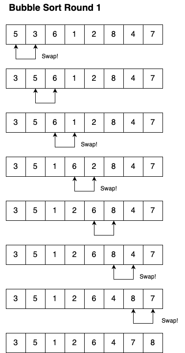

# Parallelizing Bubblesort

## Overview

In this assignment, you will apply the OpenMP library and the parallel concepts we
have been studying to the task of converting a serial algorithm, Bubblesort, into
a parallel version. Then you will time and test two versions of the parallel implementation
against the serial implementation to see the results.

Finally, you will summarize and explain your results in a report written as a Markdown file.


### Rubric

* `REPORT.md` (12 points)
    - A new well-formatted Markdown file containing your report on your debugging and timing tests
    of the code. (3 points)
    - Clear presentation of results from Step 1 (3 points)
    - Clear presentation of results from Step 2 (3 points)
    - Clear presentation of results from Step 3 (3 points)
* `bubblesort.c` (13 points)
   - Descriptive comment with your name at the top, comment on `parallel_bubblesort`,
   good coding style (2 points)
   - Step 1: Even-odd version modeled on `serial_bubblesort` defined correctly (6 points)
   - Step 2: Correct parallel loop pragma with `temp` and `j` variables private (3 points)
   - Step 3: Correct reduction addition to pragma (2 points)


### Starter Files

* `Makefile`
    - A simple makefile that will compile your program
* `bubblesort.c`
    - This file contains starter code for your program, the `main`
    function and a set of helper functions for manipulating arrays. 
    You will complete and test the `parallel_bubblesort` function


### Execution

As always, the graders should be able to build, check, and clean your code:

```
make clean
make
./bubble 10 1 2
```

### Command-line arguments for `bubble`

The main program here takes in three optional command-line arguments. You must
give them in order: either none, or just the first, or the first and second, or all
three:
* An integer, the array length
* A boolean (0 or 1), whether to print the sorted data or not
* An integer (0, 1, or 2), to generate a random, increasing, or decreasing array
    
## Tasks to Complete

### Step 0: Understanding Bubblesort

Bubblesort is one of the simplest algorithms for sorting an array of data. It
has two nested loops. Each time through the outer loop, it compares adjacent values
in the array and swaps them if they are out of order, going from indices 0 up through
the end of the array.

The image below shows one round of Bubblesort operating on a small array. The
algorithm is named because the largest values "bubble up" to the right end of the 
array. At the end of one round, we have added one more largest value to the right
end of the array (8 in the example below).



Here is pseudocode for our version of Bubblesort:
```
Bubblesort(A, length)
while there are changes to A do
    for index j = 0 to length - 2 do
        if A[j] > A[j+1] then  (if the next pair is out of order)
            swap A[j] and A[j+1]
```

Try working through the small array above, completing the additional rounds that
would be needed for the array to be in order.

Look in the `bubblesort.c` file and read through the `serial_bubblesort` function
definition. Try compiling and running the program, running on a small array length
(10 or 20). 

Experiment with the command-line arguments: setting the array length with the first,
specifying "verbose mode" with the second, and specifying the ordering of the
original array with the third.

**Make sure you understand how `serial_bubblesort` works!**

### Step 1: Building an even-odd version

To parallelize this Bubblesort algorithm, we need to make a few changes to it. The
basic idea is to have the comparisons of adjacent elements happen at the same time,
in parallel. But we need to avoid race conditions: for example, if one process
was looking at elements 3 and 4, and another was looking at 4 and 5. 

So first we will build an alternate version of `serial_bubblesort` with no OpenMP
pragmas in it (for now). In this even-odd version, we will loop over adjacent pairs
that have even-odd indices (comparing 0 to 1, 2 to 3, 4 to 5, and so forth). And
then we will loop again over adjacent pairs that have odd-even indices (comparing
1 to 2, 3 to 4, 5 to 6, etc.).

Here is pseudocode for this version of Bubblesort:
```
Even-Odd-Bubblesort(A, length)
while there are changes to A do
    for (j = 0; j < length - 1; j += 2) do
        if A[j] > A[j+1] then  (if the next pair is out of order)
            swap A[j] and A[j+1]
    for (j = 1; j < length - 1; j += 2) do
        if A[j] > A[j+1] then  (if the next pair is out of order)
            swap A[j] and A[j+1]
```

* Create a new Markdown file: `REPORT.mb` and set it up with sections for each
step. Use good style and formatting (headers, tables, etc) to record and report
on the points described throughout this assignment.

* In the `bubblesort.c` file, complete the definition of `parallel_bubblesort` according
to this pseudocode (you can copy the code for `serial_bubblesort` and then modify
it). 

* Uncomment the code in `main` that calls `parallel_bubblesort`.

* To debug your code, make a series of test runs of this code, trying different 
(short) array lengths (be sure to try both even length and odd length). 
Record the tests that you performed and include them in your report.

* Prepare to collect timing information by removing all debugging print statements
from the two Bubblesort functions

* Run a series of test runs of the program, as described below, and record the results
(in a spreadsheet)
    - Repeat the same process for random arrays, increasing arrays, and decreasing arrays
    - Try a series of array sizes: 100, 500, 1000, 5000, 10000, 25000, 50000, 100000
    - For each combination of array size and ordering, run the program 5 times
    - Record the times for Serial Bubblesort and Parallel Bubblesort
    - Compute the average of the 5 runs
    - Describe your testing process in your report. Present the results in a 
    readable format (a table or a chart), and write a one-paragraph discussion
    of the meaning of the results.

### Step 2: Trying the parallel loop pattern

**Note:** Don't undertake this step until you are **sure** your code is correct in
serial form!

* Add an OpenMP `parallel for` pragma to each of the inner `for` loops in your
`parallel_bubblesort` function. Make sure that the `temp` and `j` variables are
_private_ so that each process can do the swaps without interfering with any other processes.

* Test your code on small-sized arrays to make sure that it correctly sorts, just
as you did for the previous step. Record the test runs you tried and include 
them in your report.

* Prepare to collect timing information by removing all debugging print statements
from the two Bubblesort functions

* Run a series of test runs of the program, as described in the previous section,
record the results, and include them in your final report.

* Did the parallel loop help significantly or did it not? Explain why or why not
in your report.

### Step 3: Trying the reduction pattern

The processes in the previous version were sharing three variables: the array,
the `length` of the array, and the `changes` variable, that flags when a swap has taken
place (when no more swaps happen, the data is in order).

The length is only read, not written, and the code has been designed so that each
process works on a separate part of the array. But they do all have to work with the
`changes` variable. 

We will change the loop pattern to use **reduction**, and see if that helps with
the running time. If we reduce around the `changes` variable, then each process
will work with its own local version of `changes`, while they run in parallel, and 
then a designated _leader_ process combines the results together with the operation
given in the pragma.

* You have a pragma attached to each for loop in the code. Add the following to each
pragma: `reduction(|:changes)`. This tells OpenMP to use the reduction pattern,
focused on the `changes` variable, and combining the results with bitwise or at the
end. (We could use other operators: the local copies of `changes` from each 
process will be 0 or 1, and the leader needs to make sure that the shared `changes`
gets set to 1 if even one of the local copies is a one.)

* Be sure to pause and run small tests to make sure that you haven't introduced
any bugs into the program.

* Repeat the timing tests you ran for the previous two sections, recording the results.


